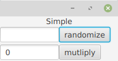
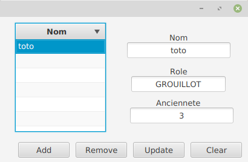

# simple-jfx

3 sample uses of jfx components and bindings. 

The entry point is the Main class in application for each case.

Try import gradle project from eclipse. 

## twoProperties

A very simple app with two binded properties. When buttons are pressed, the model change and the view is updated.

- randomize the content of the field
- multiply by 2 the content of the field

## list

An app with a list (a binded observableList) of Employes. The focus on a line print the details of an Employe. The action : add, remove will update the model and update the view.

## composition

An app to compose home made fxml components (like the previous two).

https://stackoverflow.com/questions/23600926/how-to-understand-and-use-fxroot-in-javafx